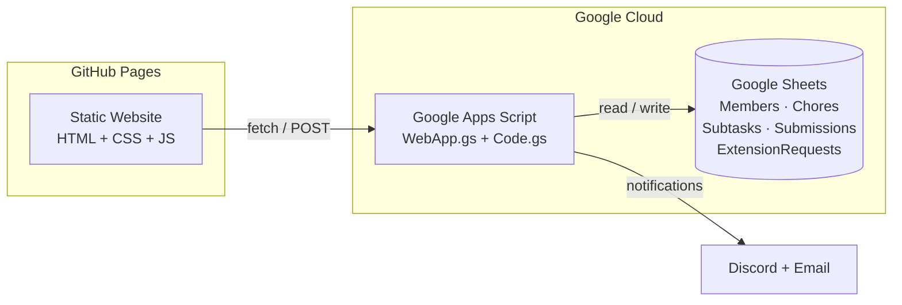
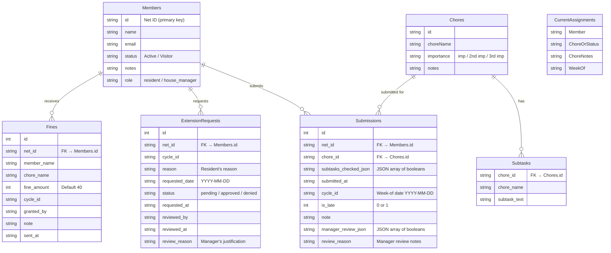

# ΓΑ Gamma Alpha — Chore Tracker

A weekly chore tracking system for the Gamma Alpha cooperative house at Cornell University. Residents check off subtasks, submit their chores, and the House Manager monitors everything from a dashboard — all powered by a Google Sheet.

---

## 📋 For Residents

### Getting Started
1. Go to the chore tracker website
2. Enter your **Cornell Net ID** (e.g. `abc12`) and click Continue
3. You'll see your assigned chore for the current week

### Submitting a Chore
- Check off each subtask ✅ as you complete it
- The progress bar fills up as you go
- Add an optional note if needed
- Click **Submit Chore** when you're ready
- You'll see a confirmation page with your submission details

### Resubmitting
If you've already submitted during the **current week's cycle**, your previous subtasks are **pre-checked** so you don't start from scratch. Just check off any new items and submit again. Previous notes are also carried over. Each new week starts fresh.

### Deadlines
- All chores are due by **Monday at 7:00 AM**
- The deadline and countdown are displayed on your screen
- Late submissions are automatically flagged and may result in a **$40 fine**

### Requesting an Extension
If you need more time:
1. Click **"Need more time? Request an extension →"** under your chore
2. Pick a date you'd like the extension until
3. Explain why you need more time
4. Click **Send Request**

You'll see the status of your request on your screen:
- ⏳ **Pending** — waiting for the House Manager to review
- ✅ **Approved** — you have until the new date
- ❌ **Denied** — with the manager's reason

### Email Notifications
You'll receive emails when:
- Your **extension request** is approved or denied (includes the decision, new deadline if approved, and the manager's note)
- The House Manager **reviews your chore submission** (includes a table showing which subtasks were verified as complete/incomplete and any feedback)

---

## 🏠 For the House Manager

### Accessing the Dashboard
1. Navigate to the **Dashboard** tab at the top
2. Enter your Net ID and password
3. You'll see the full management dashboard

> Both **House Managers** and the **President** can access the dashboard. The president can review all residents' chores, including the house manager's.

### Dashboard Overview
The dashboard shows:
- **Stats bar**: Total residents, submitted, late, pending
- **Submissions table**: Every resident's status, chore, submission time
- **Extension request panel**: Pending requests requiring your action

### Reviewing Submissions
Click **Review** on any submitted chore to open a scrollable modal:
- **Resident** column shows what the resident self-reported (✅/⬜)
- **Manager Review** column — click ✅/⬜ toggles to mark each subtask as verified complete or incomplete
- Add **review notes** in the text area (e.g. "bathroom floor still dirty")
- Click **💾 Save Review** to record your assessment — a "Reviewed" badge appears
- Click **📧 Email Review** to send the resident a styled email with your review table and notes

### Fining Residents
You can issue a **$40 fine** in two ways:
1. **From the table**: Click the **Fine $40** button in any resident's row
2. **From the review modal**: After reviewing subtasks, use the **Fine $40** button

Both prompt you for a justification note before sending. Fine notifications are sent via Discord (with @mentions to the resident and treasurer) and recorded in the Fines sheet.

### Granting Extensions
- Click **Extend** in any resident's row to manually grant a custom extension
- Or review incoming **extension requests** in the panel at the top of the dashboard
- Each request shows the resident's name, reason, and requested date
- Click **✓ Approve** or **✕ Deny** — add an optional justification note
- Approved requests automatically extend the resident's deadline
- **The resident receives an email** for both approved requests and manually granted extensions

### Notifications Sent Automatically
| Event | Email | Discord |
|-------|-------|---------|
| Extension approved/denied | ✅ Resident notified | — |
| Extension manually granted | ✅ Resident notified | — |
| Chore review emailed | ✅ Resident notified | — |
| Fine issued | — | ✅ Resident + Treasurer pinged |
| Weekly chore assignments | ✅ All residents | ✅ Channel message |

---

## 🛠️ Developer Notes

### Architecture



### Project Structure

```
gamma-alpha-chores/
├── index.html                        # Main page (resident + dashboard views)
├── style.css                         # Dark theme, glassmorphism, responsive
├── app.js                            # Frontend logic, API layer, demo data
├── README.md
└── google-apps-script/
    ├── WebApp.gs                     # API endpoints (deploy as web app)
    ├── Code.gs                       # Assignment logic, notifications
    └── ImprovedAssignment.gs         # Histogram-based chore assignment
```

### Google Sheet Structure



> **Note**: The system uses a single `ExtensionRequests` sheet for all extension data. When approved, the `requested_date` serves as the extension deadline. There is no separate `Extensions` sheet.

### Required Sheets

| Tab Name | Headers |
|----------|---------|
| `Subtasks` | `chore_id` · `chore_name` · `subtask_text` |
| `Submissions` | `id` · `net_id` · `chore_id` · `subtasks_checked_json` · `submitted_at` · `cycle_id` · `is_late` · `note` · `manager_review_json` · `review_reason` |
| `ExtensionRequests` | `id` · `net_id` · `cycle_id` · `reason` · `requested_date` · `status` · `requested_at` · `reviewed_by` · `reviewed_at` · `review_reason` |
| `Fines` | `id` · `net_id` · `member_name` · `chore_name` · `fine_amount` · `cycle_id` · `granted_by` · `note` · `sent_at` |

Existing sheets (`Chores`, `Members`, `History`, `Availability`, `Current Assignments`) remain unchanged.

> **Note**: The `Fines` sheet is auto-created the first time a fine is issued. No manual setup needed.

### API Endpoints

**GET actions** (via `?action=...&param=...`):

| Action | Parameters | Returns |
|--------|-----------|---------|
| `getMembers` | — | All members |
| `getChores` | — | All chores with subtasks |
| `getAssignments` | `cycle_id` | Current assignments |
| `getSubmissions` | `cycle_id` | All submissions for a cycle |
| `getExtensions` | `cycle_id` | Approved extension requests |
| `getExtensionRequests` | `cycle_id` | All extension requests |
| `getCycleInfo` | — | Current cycle ID, deadline, now |

**POST actions** (via JSON body `{action, ...}`):

| Action | Body | Description |
|--------|------|-------------|
| `submitChore` | `net_id, chore_id, subtasks_checked, cycle_id, note` | Submit a chore |
| `grantExtension` | `net_id, cycle_id, extended_deadline, granted_by, reason` | Grant extension (creates auto-approved request) |
| `verifyManager` | `net_id, password` | Verify manager credentials |
| `sendFine` | `net_id, member_name, chore_name, fine_amount, cycle_id, granted_by, note` | Send $40 fine notification |
| `requestExtension` | `net_id, cycle_id, reason, requested_date` | Resident requests extension |
| `approveExtension` | `request_id, decision, reviewed_by, review_reason` | Approve/deny extension request |
| `reviewSubmission` | `submission_id, review_checks, review_reason, reviewed_by` | Save manager's subtask review |
| `sendReviewEmail` | `net_id, member_name, chore_name, subtasks, review_reason, reviewed_by, cycle_id` | Email review to resident |

### Setup

#### 1. Google Sheet

Your existing sheet already has `Chores`, `Members`, `History`, `Availability`, and `Current Assignments`.

Add the new tabs listed in **Required Sheets** above (just headers in row 1, data is auto-filled).

Add a `role` column (column F) to the `Members` sheet. Set to `house_manager` for the manager and `president` for the president. Both roles can access the dashboard.

Add a `password` column (column G) for each dashboard user.

#### 2. Apps Script

1. Open your Google Sheet → **Extensions → Apps Script**
2. Your existing `Code.gs` stays — don't change it
3. Create a new script file: click **+** → **Script** → name it `WebApp`
4. Paste the contents of [`WebApp.gs`](google-apps-script/WebApp.gs)
5. Save, then select `seedSubtasks` from the function dropdown → click **▶ Run**
6. **Deploy → New Deployment → Web App** (Execute as: Me, Access: Anyone)
7. Copy the deployment URL

#### 3. Frontend Configuration

In `app.js`, update the configuration at the top:

```js
const API_URL = 'https://script.google.com/macros/s/YOUR_URL/exec';
const DEMO_MODE = false;
```

In `google-apps-script/Code.gs`, update the notification constants:

```js
const CHORE_SUBMIT_URL = "https://your-github-username.github.io/chores/";
const DISCORD_WEBHOOK_URL = "https://discord.com/api/webhooks/YOUR_WEBHOOK";
```

#### 4. Time Zone

In the Apps Script editor, go to ⚙️ **Project Settings** and make sure the time zone is set to **`(GMT-05:00) Eastern Time`** so the Monday 7 AM deadline aligns with Cornell's time zone.

#### 5. Deploy

Push to GitHub and enable **GitHub Pages** (Settings → Pages → Source: main branch).

### Weekly Cycle


### Assignment Algorithm

The chore assignment uses histogram-based global bipartite matching to ensure each resident does every chore an equal number of times over the long run.

### Tech Stack

- **Frontend**: Vanilla HTML/CSS/JS — no build tools, no framework
- **Backend**: Google Apps Script (serverless)
- **Database**: Google Sheets
- **Hosting**: GitHub Pages
- **Notifications**: Discord webhook + Gmail

---

## License

Internal use — Gamma Alpha Cooperative, Cornell University.
