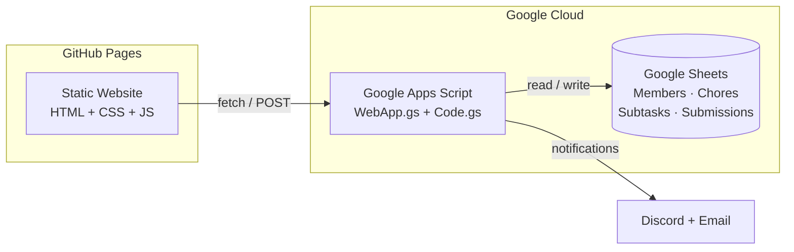
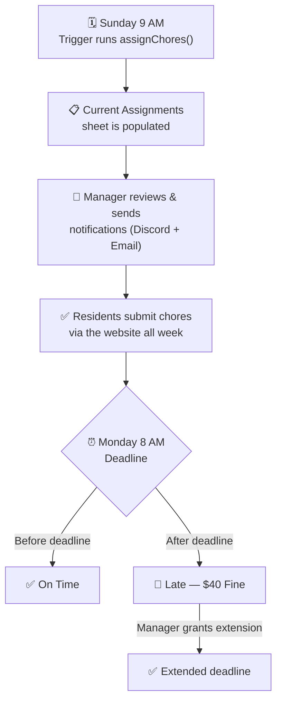
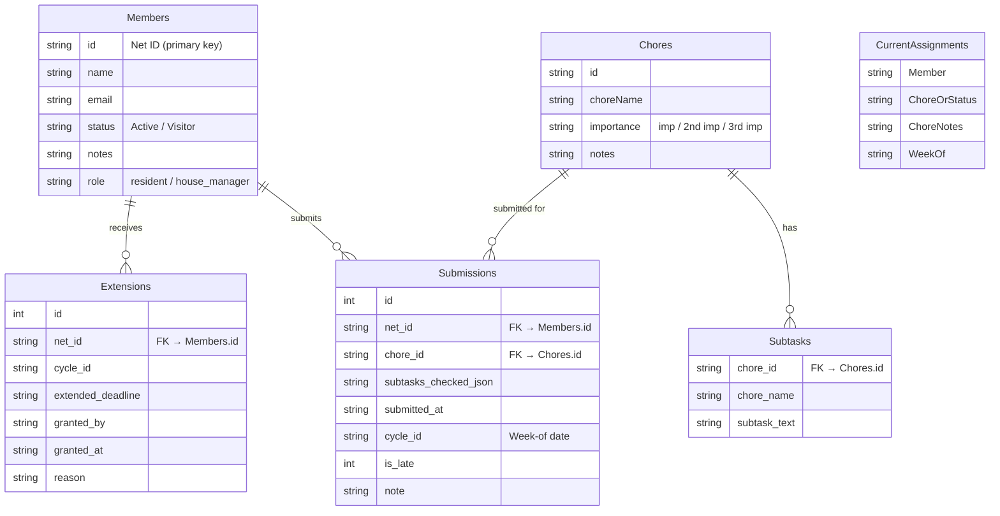
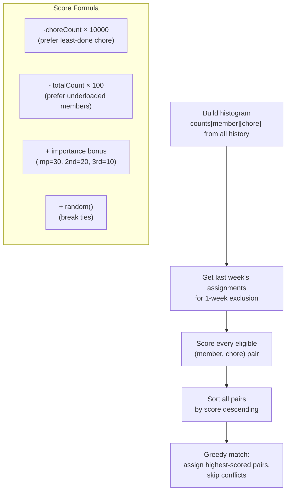

# ΓΑ Gamma Alpha — Chore Tracker

A weekly chore tracking system for the Gamma Alpha cooperative house at Cornell University. Residents check off subtasks, submit their chores, and the House Manager monitors everything from a dashboard — all powered by a Google Sheet.

## How It Works



### Weekly Cycle



## Features

| Feature | Description |
|---------|-------------|
| **Resident Submission** | Enter Net ID → see assigned chore → check off subtasks → submit |
| **Partial Completion** | Submit even if not all subtasks are done |
| **Multiple Submissions** | Resubmit anytime — all records are kept, latest shown |
| **Submission Notes** | Optional note attached to each submission |
| **Manager Dashboard** | Stats, submission table, late flagging with $40 fine badges |
| **Extensions** | Manager can grant custom deadline extensions per resident |
| **Dynamic Subtasks** | Chores and subtasks read live from Google Sheets — edit anytime |
| **Fair Assignment** | Histogram-based algorithm ensures uniform chore distribution |
| **Demo Mode** | Works offline for testing — no Google Sheet needed |

## Project Structure

```
gamma-alpha-chores/
├── index.html                        # Main page (both views)
├── style.css                         # Dark theme, glassmorphism, responsive
├── app.js                            # Frontend logic + demo data
├── README.md
└── google-apps-script/
    ├── WebApp.gs                     # API endpoints (paste into Apps Script)
    └── ImprovedAssignment.gs         # Better chore assignment algorithm
```

## Google Sheet Structure



**Existing sheets** (used by the assignment script): `Chores`, `Members`, `History`, `Availability`, `Current Assignments`

**New sheets** (added for the web tracker): `Subtasks`, `Submissions`, `Extensions`

## Setup

### 1. Google Sheet

Your existing sheet already has `Chores`, `Members`, `History`, `Availability`, and `Current Assignments`.

Add **3 new tabs** (just headers in row 1, data is auto-filled):

| Tab Name | Headers |
|----------|---------|
| `Subtasks` | `chore_id` · `chore_name` · `subtask_text` |
| `Submissions` | `id` · `net_id` · `chore_id` · `subtasks_checked_json` · `submitted_at` · `cycle_id` · `is_late` · `note` |
| `Extensions` | `id` · `net_id` · `cycle_id` · `extended_deadline` · `granted_by` · `granted_at` · `reason` |

Add a `role` column (column F) to the `Members` sheet. Set to `house_manager` for the manager.

### 2. Apps Script

1. Open your Google Sheet → **Extensions → Apps Script**
2. Your existing `Code.gs` stays — don't change it
3. Create a new script file: click **+** → **Script** → name it `WebApp`
4. Paste the contents of [`WebApp.gs`](google-apps-script/WebApp.gs)
5. Save, then select `seedSubtasks` from the function dropdown → click **▶ Run**
6. **Deploy → New Deployment → Web App** (Execute as: Me, Access: Anyone)
7. Copy the deployment URL

### 3. Frontend

In `app.js`, update line 10 and 13:

```js
const API_URL = 'https://script.google.com/macros/s/YOUR_URL/exec';
const DEMO_MODE = false;
```

### 4. Deploy

Push to GitHub and enable **GitHub Pages** on the repository (Settings → Pages → Source: main branch).

## Assignment Algorithm

The chore assignment uses histogram-based global bipartite matching to ensure each resident does every chore an equal number of times over the long run.



## Tech Stack

- **Frontend**: Vanilla HTML/CSS/JS — no build tools, no framework
- **Backend**: Google Apps Script (serverless)
- **Database**: Google Sheets
- **Hosting**: GitHub Pages
- **Notifications**: Discord webhook + Gmail

## License

Internal use — Gamma Alpha Cooperative, Cornell University.
